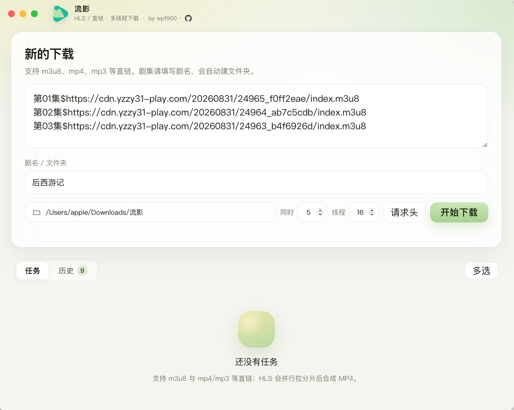
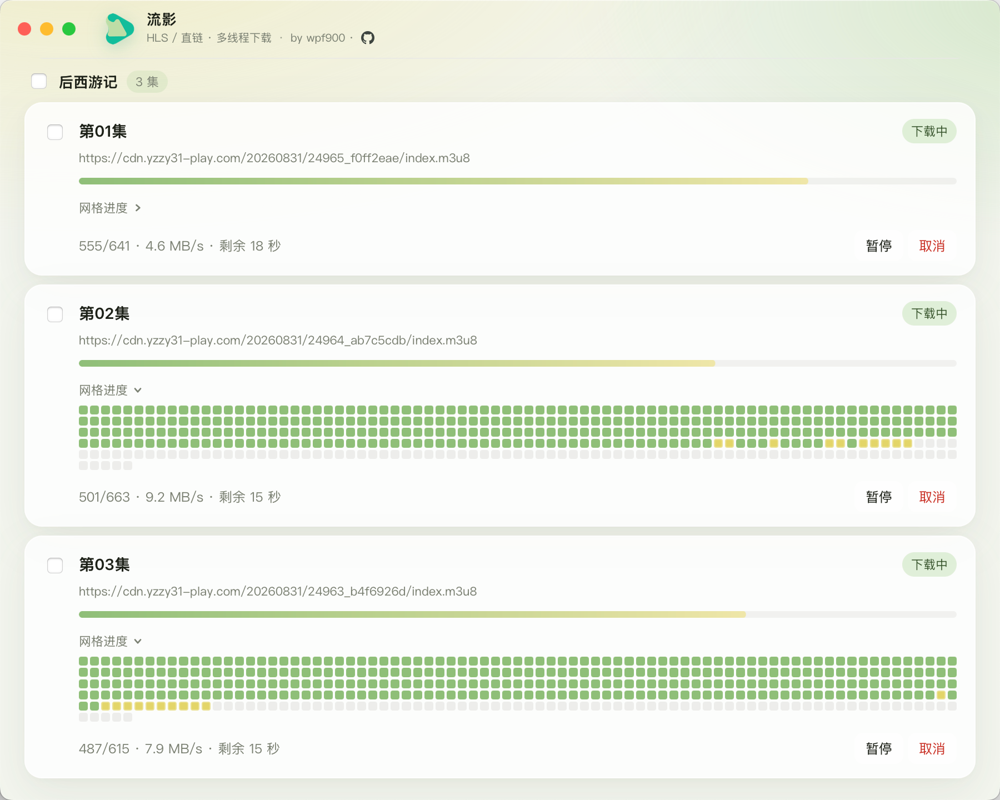
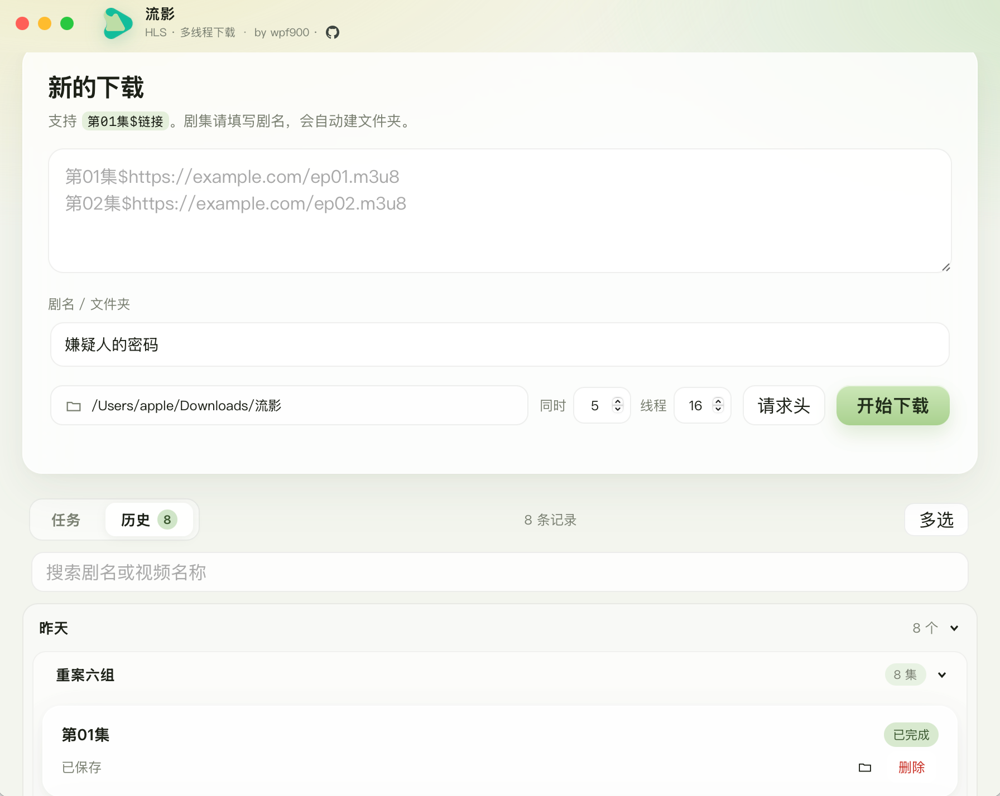

# 流影

by wpf900 · [](https://github.com/wpf900/m3u_down)

跨平台 HLS（m3u8）下载桌面应用。粘贴链接后多线程拉取分片，再用内置 ffmpeg 合成 MP4。也支持 mp4、mp3 等直链文件下载。

支持 **Windows x64**、**macOS Apple 芯片**、**macOS Intel**。

## 效果预览

| 新建下载 | 下载进度 | 历史记录 |
|:---:|:---:|:---:|
|  |  |  |

## 下载安装包

安装包会出现在仓库首页的 **[Releases](https://github.com/wpf900/m3u_down/releases)**，而不是 Packages。

Packages 是给 Docker / npm 这类包用的，这个桌面应用不需要。

任何人都可以下载 Releases，无需登录。打包、发版只有仓库管理员能操作。

### 从 Releases 下载（推荐）

打开 [Releases](https://github.com/wpf900/m3u_down/releases)，选最新版本，下载：

| 文件 | 适用系统 |
|---|---|
| `Liuying-windows-x64.zip` | Windows 10 / 11（64 位） |
| `Liuying-macos-arm64.zip` | Apple 芯片 Mac（M1 / M2 / M3 / M4） |
| `Liuying-macos-intel.zip` | Intel Mac |

### 自己发一个新版本

**方式 A：打标签（以后推荐）**

```bash
git tag v1.0.1
git push origin v1.0.1
```

会自动打包。哪个平台先打完，安装包就会先出现在同一个 Release 里，不必等三个都完成。

**方式 B：在网页上点**

1. 打开 [Actions → Build](https://github.com/wpf900/m3u_down/actions/workflows/build.yml)
2. **Run workflow**
3. `version` 填 `v1.0.1`（必须带 `v`）
4. 哪个平台打完，哪个 zip 就会出现在 Releases；Intel Mac 若在排队，不挡住另外两个

如果 `version` 留空，只会生成 **Artifacts**（临时文件，大约 90 天过期），**不会**出现在 Releases 页面。

### Windows 怎么用

1. 解压 zip，进入里面的 `Liuying` 文件夹
2. 确认同时有 `Liuying.exe` 和 `_internal` 文件夹，再双击 exe（不要只拷贝 exe）
3. 会打开一个 Microsoft Edge 应用窗口（Win10 / 11 一般已自带 Edge）。若没有窗口，安装 [Microsoft Edge](https://www.microsoft.com/edge) 后再开
4. 启动失败时会弹窗，日志在 `%APPDATA%\Liuying\error.log`

### Mac 怎么用

1. 解压 zip，得到 `Liuying.app`
2. 拖到「应用程序」或直接双击
3. 未做 Apple 开发者签名。若提示「已损坏」或无法打开：

```bash
xattr -cr /Applications/Liuying.app
```

然后对图标 **右键 → 打开**。

安装包已内置 ffmpeg，用户不必再装 Python 或 ffmpeg。

## 使用方法

1. 选择保存目录（默认：`下载/流影`）
2. 粘贴 m3u8 链接，点 **开始下载**
3. 多集可填剧名，会自动建子文件夹

链接格式示例：

```
https://example.com/ep01.m3u8

第01集$https://example.com/ep01.m3u8
第02集$https://example.com/ep02.m3u8
```

- **同时**：并行下载的剧集数（1–8）
- **线程**：单集分片并发数（1–64）
- **请求头**：需要防盗链时填写 Referer / User-Agent

## 本地开发

需要 Python 3.12+。Mac 开发时系统里有 ffmpeg 更方便（打包时会再下载一份静态 ffmpeg）。

```bash
python3 -m venv .venv
source .venv/bin/activate          # Windows: .venv\Scripts\activate
pip install -r requirements.txt
python app.py
```

Mac 开发时若 Dock 没有「流影」图标（终端里 `python app.py` 常见），可生成开发用应用包后双击启动：

```bash
python scripts/make_dev_app.py
open Liuying-Dev.app
```

## 本地打包

必须在对应系统上打包，不能在 Mac 上打出 Windows exe。

```bash
pip install -r requirements.txt -r requirements-build.txt
python scripts/build.py
```

| 系统 | 产物 |
|---|---|
| macOS | `dist/Liuying.app` |
| Windows | `dist/Liuying/Liuying.exe` |

脚本会自动生成图标、下载对应平台的静态 ffmpeg，再调用 PyInstaller。

## 项目结构

```
app.py                 窗口与设置
downloader.py          HLS 解析、分片下载、ffmpeg 合并
web/                   界面
scripts/build.py       当前系统一键打包
.github/workflows/     GitHub Actions 云端打包
```

配置文件位置：

- macOS：`~/Library/Application Support/Liuying/settings.json`
- Windows：`%APPDATA%\Liuying\settings.json`
